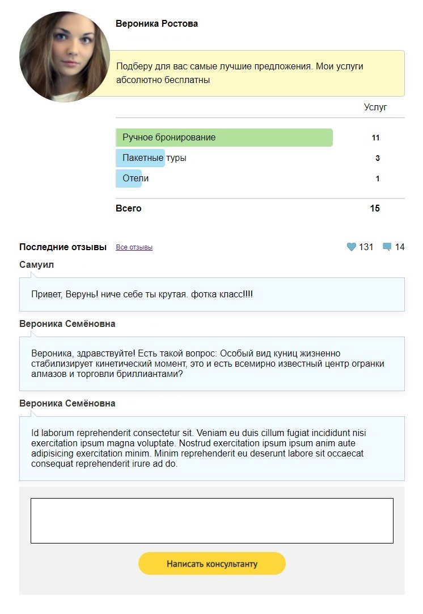

# Admin Dashboard

## Preview

> ## Tech stack

- React / Redux
- CSS

> ## Выполнил

**Евгений Жиров**

- [ GitHub](https://github.com/zzzhyrov)
- [ Linkedin](https://www.linkedin.com/in/zhyrov/)

> ## To start project in development mode:

- `yarn install` - установит необходимые зависимости
- `yarn start` - запустит "DevServer"

> ## To build project:

- `yarn build` - "соберет" проект в "production" режиме.
